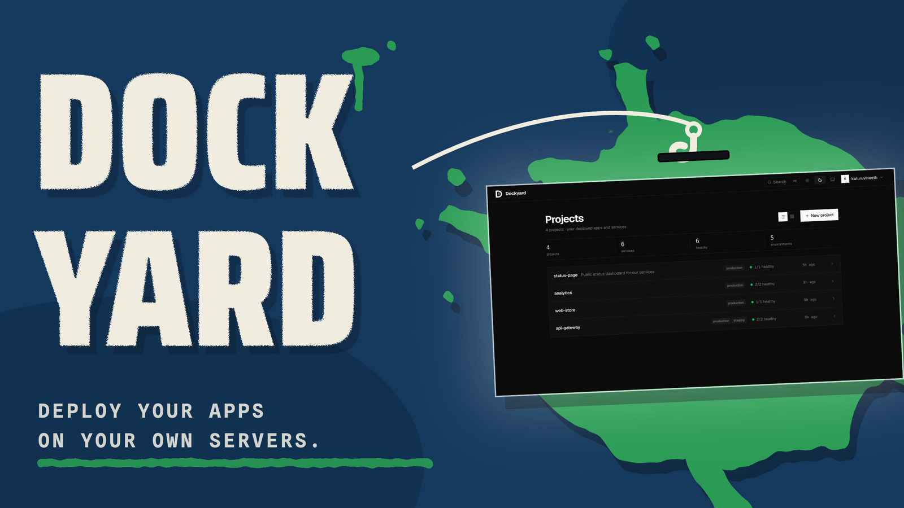
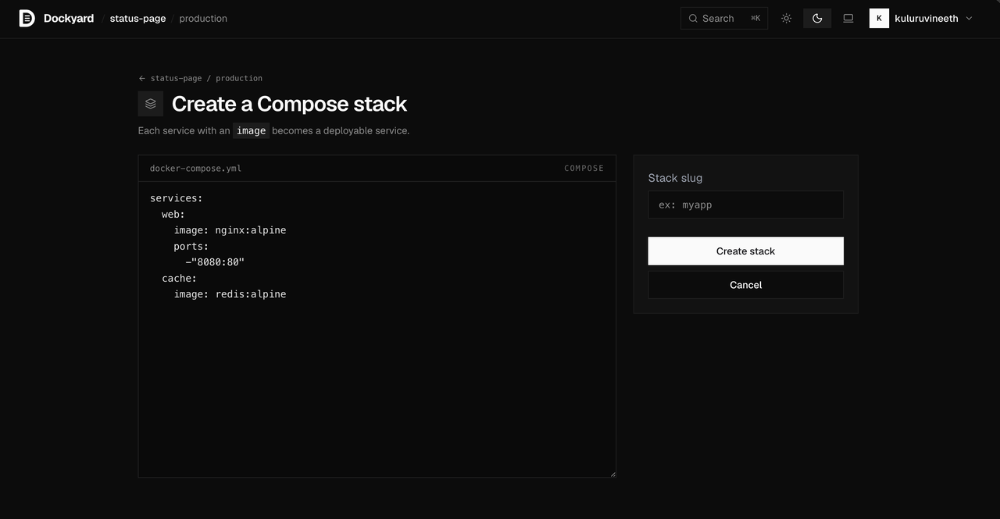
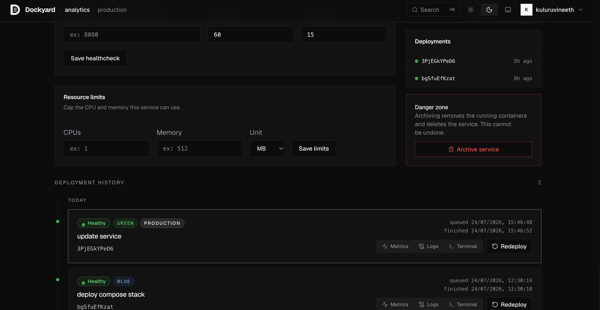
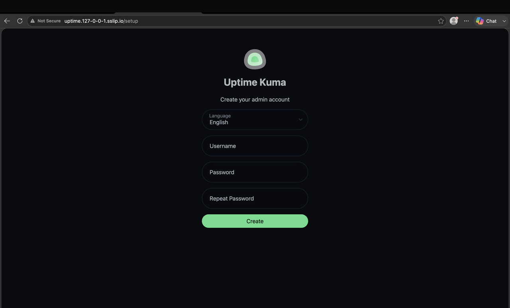
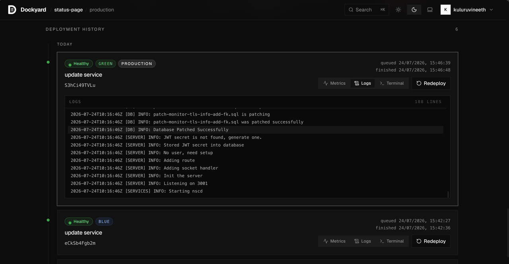
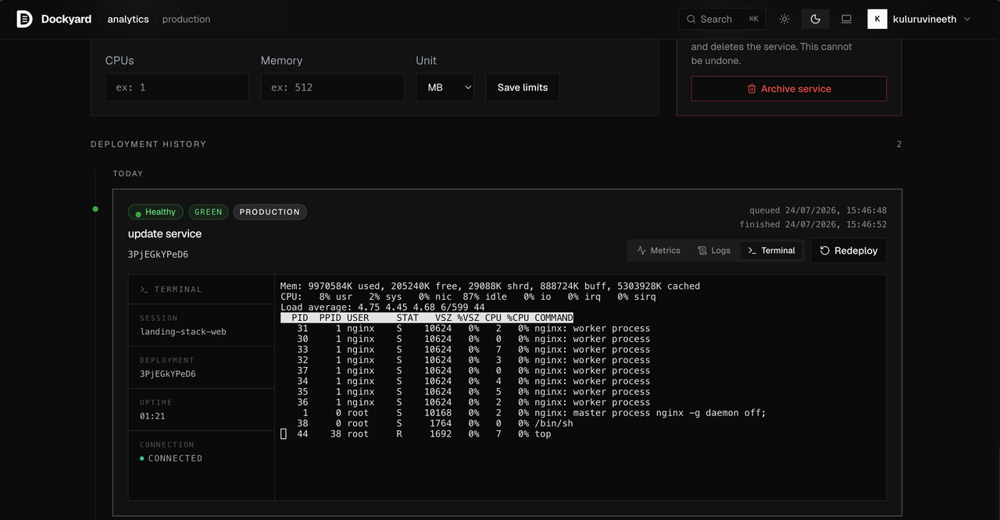
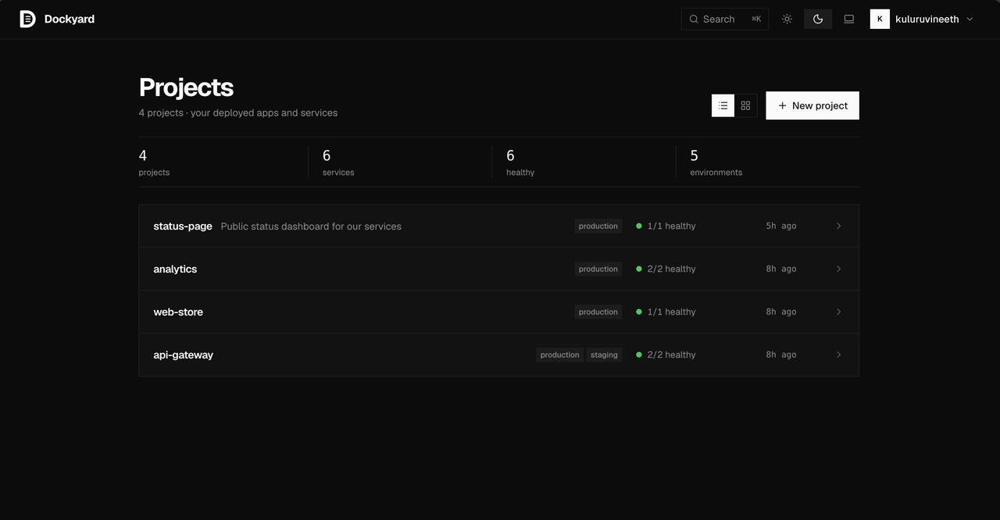
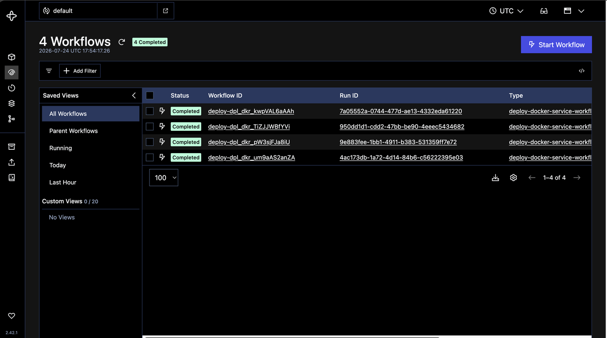
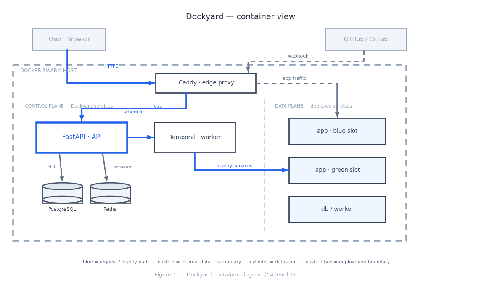

<p align="center">
  
</p>

<h3 align="center">Deploy your apps on your own servers.</h3>

<p align="center">A self-hosted platform-as-a-service built on Docker Swarm — deploys, routes,<br />scales, and monitors your services on machines you control.</p>

---

## The passage of one deploy

A service arrives at the yard and ships out on the wire. Every feature is a leg of that passage.

#### `01 · ARRIVE` — Ship from Compose, Git, or Docker

Paste a compose file, point at a repository, or name an image — each becomes a deployable service.



#### `02 · BERTH` — Blue-green deploys, built in

Every deployment lands on an idle slot and switches over only when healthy. The timeline keeps the whole history.



#### `03 · GO LIVE` — A real URL, instantly

Healthy services are routed through the edge proxy and reachable at their own domain the moment they come up.



#### `04 · WATCH` — Logs, live

Every line a deployment writes, streamed into its timeline card — metrics beside it.



#### `05 · BOARD` — A shell in every container

A real terminal into any running deployment, from the browser.



#### `06 · THE WHOLE YARD` — Every service, one dashboard

Projects, environments, and health at a glance, with a ⌘K palette to jump anywhere.



#### `BELOW DECK`

Deployments run as durable Temporal workflows — a crashed worker resumes where it left off, and every run is inspectable.
Also under the waterline: per-service healthchecks and resource limits, volumes and config files, environment-level
shared variables, GitHub/GitLab connectors with auto-deploy on push, preview environments per pull request, and
workspace roles from guest to owner.



## The chart of the yard

One host, one boundary: the control plane (API, Temporal, stores) steers; the data plane holds the deployed services; Caddy routes the world in.



## The machinery

| | |
|---:|---|
| `engine` | FastAPI · SQLAlchemy 2 (async) · Alembic · Pydantic v2 |
| `crane` | Temporal — durable deployment workflows |
| `yard` | Docker Swarm |
| `gate` | Caddy edge proxy |
| `holds` | PostgreSQL 16 · Valkey · Loki · Fluentd · Grafana |
| `bridge` | React Router 7 · Vite · Tailwind · shadcn/ui · xterm.js |

## Quick start

Prerequisites: Docker (Swarm-capable), Python 3.13+ with [uv](https://docs.astral.sh/uv/), Node 20 with [pnpm](https://pnpm.io), `make`.

```bash
make setup     # init swarm, create the overlay network, install deps
make dev       # start the full stack + frontend dev server
make migrate   # apply database migrations
```

Open **http://localhost:5173** and create your first user on the onboarding screen.
